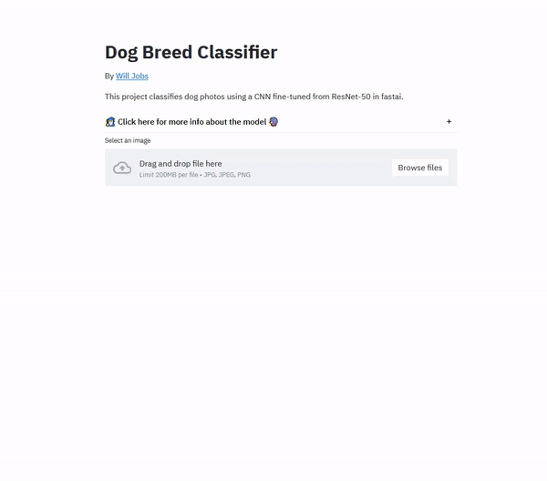

# Dog classifier

### 🚨 **NOTE:** This project was turned into a [web app](https://willjobs.com/dogs). See the [GIF below](#app).
---

This project uses transfer learning to build a CNN pre-trained on ImageNet, with ResNet-50 architecture, to classify dog breeds. The training dataset is the [Stanford Dogs Dataset](http://vision.stanford.edu/aditya86/ImageNetDogs/) and images from the internet for AKC dog breeds not in the Stanford dogs dataset (see below). The [fastai](https://github.com/fastai/fastai) library (v2), which is a high-level library on top of PyTorch, was used for creating the model.

Edit: An experiment using only images downloaded from the internet for all dog breeds showed better performance on the test set and on my own images of dogs I know. This new model is in [Dogs_Classifier_Online.ipynb](Dogs_Classifier_Online.ipynb). This may be due to a difference between the Stanford dog images and typical photos, e.g., if there was any preprocessing done on the Stanford dog images that I am unaware of. 

A 10% test set (holdout set) was set aside and hidden from fastai. The validation set was 20% of the remaining data. Both the test set and validation set were chosen as stratified samples to maintain class balance in the datasets.

Zero-padding was used when resizing images to a common size in order to maintain the aspect ratio of the original image. The default fastai augmentation transforms (horizontal flip, random rotation up to 10 degrees, a random zoom between 1.0x and 1.1x, a perspective warping, and random change in brightness and contrast; see [the fastai documentation](https://docs.fast.ai/vision.augment.html#aug_transforms)) were used during training to improve the generalization performance of the model. Note that this augmentation strategy does not increase the number of images in each epoch; it just randomly alters each image in each batch, so that a given image will be viewed differently in each epoch.

A learning rate was chosen using the `lr_find` feature in fastai, which starts with a very small learning rate, uses that for one mini-batch, calculates the losses, then increases the learning rate and repeats until the loss gets worse. Then the learning rate selected is the part of the loss vs. learning rate curve where the loss decreases the quickest before increasing again. See the fastai book, chapter 5 (search for "learning rate finder" [here](https://github.com/fastai/fastbook/blob/master/05_pet_breeds.ipynb)).

The holdout set was evaluated on the final model, given a test set accuracy of 53.76%, compared to a random chance of 1/150 = 0.67% (because there are 150 dog breeds).

Finally, I used the trained model to make predictions of breeds on dogs that I know, as well as the top 5 after the best guess.

Some dog names in the Stanford dataset were renamed based on their names in the AKC.
* Airedale → Airedale Terrier
* Basset → Basset Hound
* Boston bull → Boston Terrier
* Cairn → Cairn Terrier
* Cardigan → Cardigan Welsh Corgi
* Chow → Chow Chow
* Dingo → Carolina Dog
* Entlebucher → Entlebucher Mountain Dog
* Pekinese → Pekingese
* Pembroke → Pembroke Welsh Corgi
* Scotch terrier → Scottish terrier
---
## Future work:
* add a nearest neighbors analysis to find the nearest dog images in the dataset, based on the CNN's last-layer embedding (before the FC layer)
* add saliency maps (and/or GradCAM)
* an object detection model using the bounding boxes given in the Stanford dogs dataset

---
## Don't see your dog?

🤔 Don't see your dog breed? For a full list of dog breeds in this project, [click here](dog_breeds.html).

---
## App

