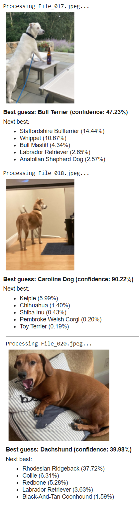

# Dog classifier
This project uses transfer learning to build a CNN pre-trained on ImageNet, with ResNet-18 architecture, to classify dog breeds. The training dataset is the [Stanford Dogs Dataset](http://vision.stanford.edu/aditya86/ImageNetDogs/).

